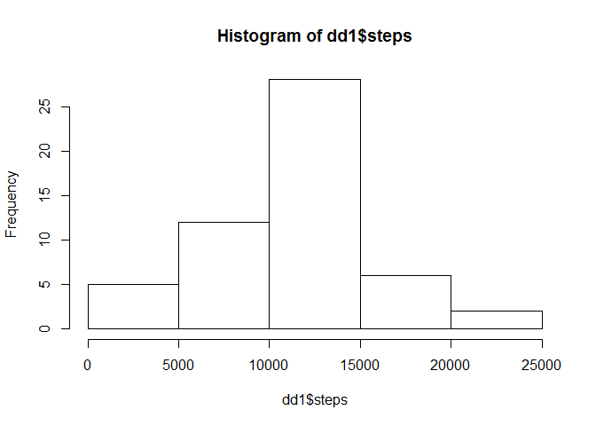
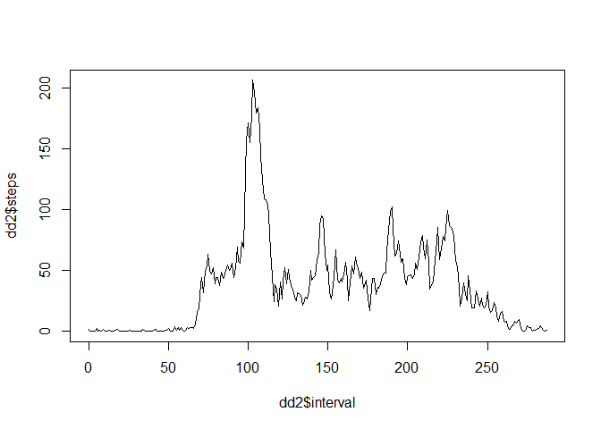

# Reproducible Research: Peer Assessment 1

Load in required libraries first.


```r
require(ggplot2)
```

```
## Loading required package: ggplot2
```

```r
require(data.table)
```

```
## Loading required package: data.table
```

## Loading and preprocessing the data

Let's unpack the data first. (The data is in a zip file in ddthe github repo.)
Unzip and then read in, and do a quick summary.


```r
unzip('activity.zip')
z <- read.csv('activity.csv', stringsAsFactors = FALSE)
summary(z)
```

```
##      steps            date              interval     
##  Min.   :  0.00   Length:17568       Min.   :   0.0  
##  1st Qu.:  0.00   Class :character   1st Qu.: 588.8  
##  Median :  0.00   Mode  :character   Median :1177.5  
##  Mean   : 37.38                      Mean   :1177.5  
##  3rd Qu.: 12.00                      3rd Qu.:1766.2  
##  Max.   :806.00                      Max.   :2355.0  
##  NA's   :2304
```

We have some NA's. We just want to ignore those days with missing data.

Let's also aggregate the number of steps by day, and by interval.


```r
z1 <- data.table(na.omit(z))
dd1 <- z1[,sum(steps), by = date]
setnames(dd1, 'V1', 'steps')

i <- (z1$interval %/% 100)*12 + (z1$interval %% 100) %/% 5
z1[,'i'] <- i
dd2 <- z1[,mean(steps), by = i]
setnames(dd2, 'V1', 'steps')
setnames(dd2, 'i', 'interval')
str(dd2)
```

```
## Classes 'data.table' and 'data.frame':	288 obs. of  2 variables:
##  $ interval: num  0 1 2 3 4 5 6 7 8 9 ...
##  $ steps   : num  1.717 0.3396 0.1321 0.1509 0.0755 ...
##  - attr(*, ".internal.selfref")=<externalptr>
```

## What is mean total number of steps taken per day?


```r
hist(dd1$steps)
```

 

```r
m1 <- mean(dd1$steps)
m2 <- median(dd1$steps)
```
So the mean = 1.0766189\times 10^{4}

And the median is 10765


## What is the average daily activity pattern?


```r
plot(dd2$interval, dd2$steps, type = 'l')
```

 

```r
q <- 5* (which(dd2$steps == max(dd2$steps)) - 1)
iv <- (q %/% 60)*100 + (q %% 60)
```

The interval with the greatest average number of steps = 835.

## Imputing missing values


```r
nn <- nrow(z) - nrow(z1)
```
The total number of NAs is


## Are there differences in activity patterns between weekdays and weekends?
